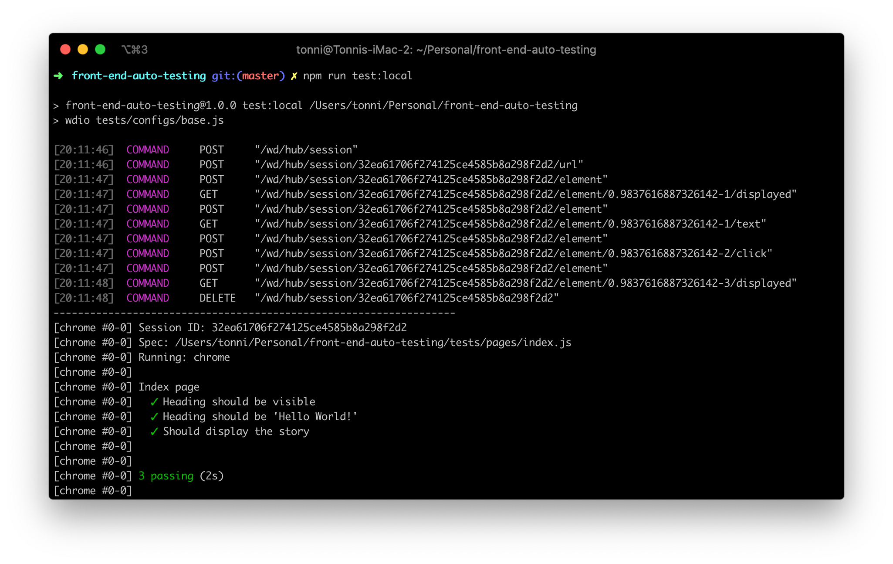

# front-end-auto-testing

Auto testing with WebdriverIO(v4)

## Requirements

1. macOS(I didn’t test this repo on Windows, but WebdriverIO and Selenium worked fine on Windows).
1. Chrome and [JDK](http://www.oracle.com/technetwork/java/javase/downloads/index.html) is installed.
1. NodeJS version >= 6.

## Setup

1. `$ npm install`.
1. Install drivers: `$ ./node_modules/.bin/selenium-standalone install`.

## Start testing

Create a HTTP server: `$ npm run http`.

### Local test(Chrome)

`$ npm run test:local`.

### Headless test(Chrome)

`$ npm run test:ci`.

If you wanted to run tests in Travis CI, please read this doc for more info: https://docs.travis-ci.com/user/chrome , it also supports Firefox https://docs.travis-ci.com/user/firefox .

### Cloud test(BrowserStack)

Please read the official doc provided by BrowserStack https://www.browserstack.com/automate/webdriverio .

## Troubleshooting

### Unable to start tests

Please make sure your VPN is connected during tests, standalone-service sends few requests to googleapis.com before running tests, which are blocked in mainland China.

If you don’t have a VPN, please uncomment the [selenium-standalone service](http://webdriver.io/guide/services/selenium-standalone.html#Configuration) in [./tests/configs/base.js](./tests/configs/base.js) and use `$ npm run selenium` to start Selenium server manually.

### Unable to find element on closed window on IE 11 in Selenium

Please follow this troubleshooting steps to fix it: http://stackoverflow.com/a/40837196/4480674.

### Error: GDK_BACKEND does not match available displays

This problem often happens on some Linux distributions e.g. Ubuntu, XUbuntu.

Please follow this to fix it: http://unix.stackexchange.com/a/138941.
